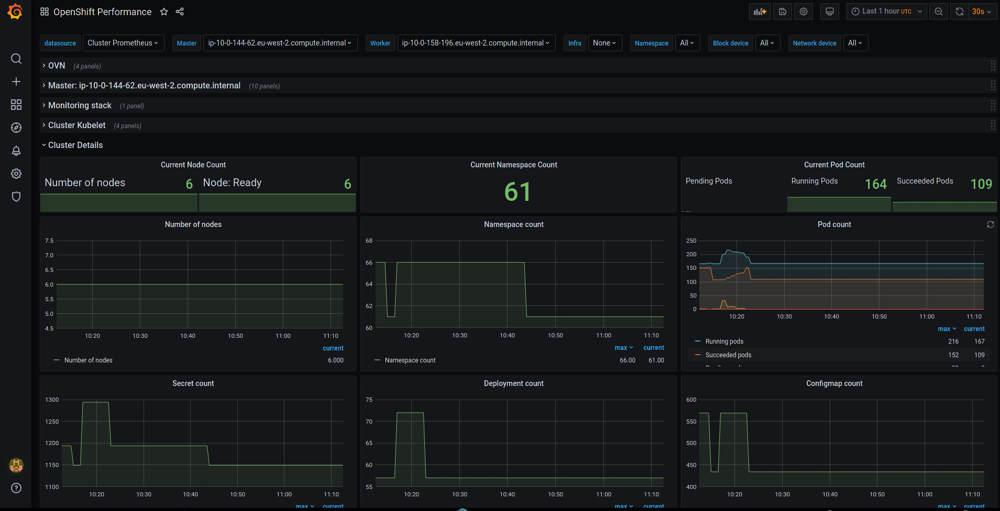

# Visualize



## What is it

[krkn-visualize](https://github.com/krkn-chaos/visualize) deploys a Grafana dashboard to your Kubernetes or OpenShift cluster for monitoring chaos engineering runs. It automates the setup of Elasticsearch and optional Prometheus datasources.

For full documentation see: https://krkn-chaos.dev/docs/performance_dashboards/

## Prerequisites

- [`krknctl`](https://krkn-chaos.dev/docs/krknctl/usage/) installed
- A running Kubernetes or OpenShift cluster with a valid kubeconfig
- An accessible Elasticsearch instance
- (Optional) A running Prometheus instance

## Deploy

### Deploy Grafana with Dashboards

```
$ ./deploy.sh -e <es_url> -p <grafana_password>
```

See `./deploy.sh -h` for all available flags.

**Example:**

```
$ ./deploy.sh \
    -e http://elasticsearch:9200 \
    -p secret \
    -P http://prometheus:9090 \
    -n krkn-visualize
```

### Delete Grafana Deployment

```
$ ./deploy.sh -d
```

## Available Flags

| Flag | Description | Default |
|------|-------------|---------|
| `-e` | Elasticsearch URL (required) | — |
| `-u` | Elasticsearch username | — |
| `-s` | Elasticsearch password | — |
| `-P` | Prometheus datasource URL | — |
| `-b` | Prometheus bearer token | — |
| `-n` | Target namespace | `krkn-visualize` |
| `-p` | Grafana admin password (required) | — |
| `-k` | kubectl binary (use `oc` for OpenShift) | `kubectl` |
| `-c` | Path to kubeconfig | `~/.kube/config` |
| `-d` | Delete existing deployment | — |
